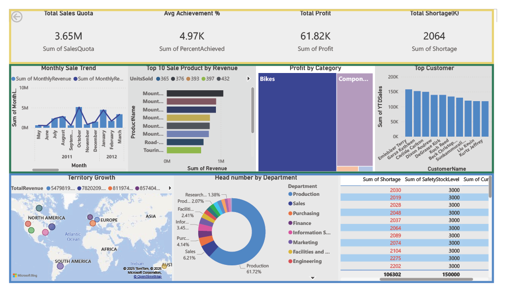

# 📊 AdventureWorks Performance Dashboard

This repository contains a Power BI dashboard that visualizes key business metrics from the AdventureWorks2019 SQL database. It provides insights into sales performance, customer behavior, product profitability, territory growth, and operational efficiency.

## 🚀 Dashboard Highlights

### 🔹 Strategic KPIs
- **Sales Quota**: Total quota assigned across territories
- **Percent Reached**: Actual sales vs quota achievement
- **Profit**: Aggregated profit across categories
- **Shortage**: Product units below safety stock levels

### 🔹 Sales Performance
- **Monthly Sale Trend**: Revenue and profit trends over time
- **Top 10 Products by Revenue**: Highest earning products
- **Profit by Category**: Breakdown by Bikes, Components, Clothing, etc.

### 🔹 Customer & Territory Insights
- **Top Customers**: Customers with highest shortage impact
- **Territory Growth**: Global revenue distribution across regions

### 🔹 Operational Metrics
- **Headcount by Department**: Distribution of employees across departments
- **Customer Shortage Table**: Detailed shortage and cost per customer
- **Employee Performance**: Sales quota, percent reached, and profit by employee

## 🧠 Data Source

- **Database**: AdventureWorks2019
- **Connection**: SQL Server (DirectQuery or Import)
- **Tables Used**: `SalesOrderHeader`, `SalesOrderDetail`, `Product`, `Customer`, `Employee`, `Department`, `SalesTerritory`, `ProductCategory`, `ProductInventory`

